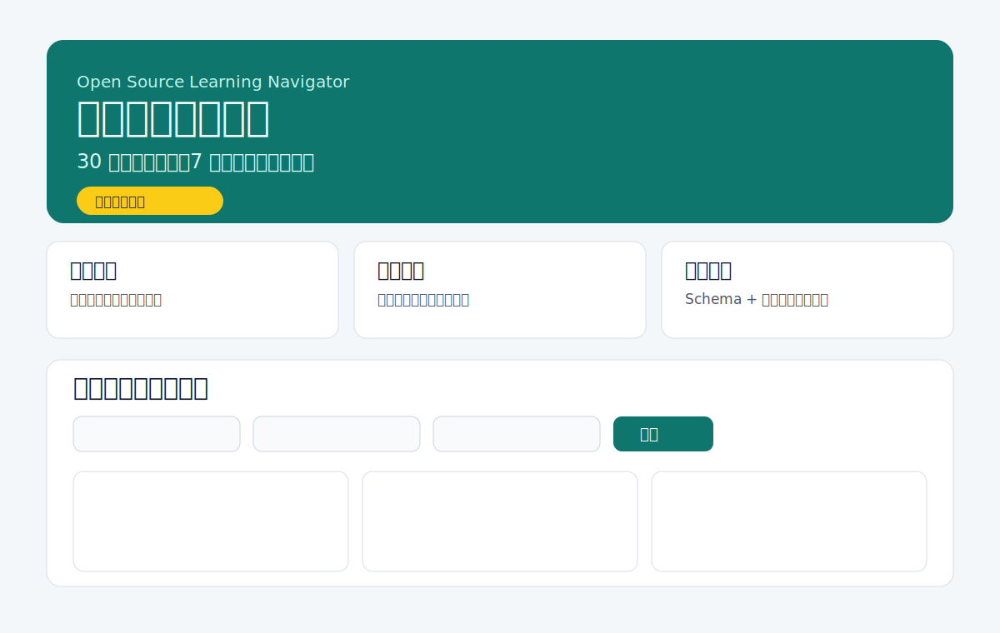

# 高星教育开源项目

面向中文学习者的轻量开源学习导航。目标是用最短时间帮你确定“下一步学什么”，而不是继续在收藏夹里犹豫。

- 线上访问：<https://ppchanning.github.io/highstar-edu-oss/>
- 项目类型：静态站点 + 结构化学习内容 + 可复现部署

## 价值主张

- 减少信息噪声：把分散教程整合成结构化学习路径
- 降低决策成本：支持按方向、难度、标签筛选
- 提升学习连续性：给出可执行的路径与资源组合

## 目标用户

- 想系统入门但不确定从哪开始的中文学习者
- 需要在有限时间内高效筛选优质资源的转岗/进阶学习者
- 希望以开源方式共建教育资源索引的贡献者

## 示例截图



> 当前截图为项目首页结构示意，保证仓库内可预览与版本可追踪。

## 学习路径

当前内置 3 条路径：

- Web 前端
- Python 数据方向
- 算法与求职准备

每条路径包含方向、难度、标签与资源入口，可在页面中组合筛选。

## 快速开始

```bash
npm install
npm run start
```

本地访问：`http://localhost:4173`

## 内容地图

- `index.html`：首页信息结构与筛选入口
- `data/content.js`：学习路径与资源数据
- `src/filter.js`：筛选逻辑
- `src/schema.js`：内容 schema 校验
- `docs/deployment.md`：发布、重部署、回滚与故障排查

## 维护节奏

- 每周滚动维护资源可达性与内容描述
- 变更通过 `CHANGELOG.md` 记录
- 优先修复影响首屏可读性与学习路径可执行性的缺陷

## 质量保障

提交前执行：

```bash
npm test
npm run check:links
```

- `npm test`：校验 schema 与筛选关键路径
- `npm run check:links`：校验外链可达性（含重试）

## 路线图

- 补充更多中文优质资源与分级学习目标
- 增加“7 天行动清单”模板
- 引入轻量数据看板（资源点击与反馈）

## 贡献指南

欢迎提 issue / PR。开始前请阅读 [CONTRIBUTING.md](./CONTRIBUTING.md)。

## FAQ

### 这是不是完整课程平台？

不是。本项目定位是学习导航与资源整合，不替代系统课程。

### 我可以添加自己的学习路线吗？

可以。请按 `data/content.js` 结构提交，并附带资源来源与适用人群说明。

### 为什么强调可复现部署？

教育内容项目需要长期可信。可复现部署可以让维护者和使用者都快速验证线上状态。
